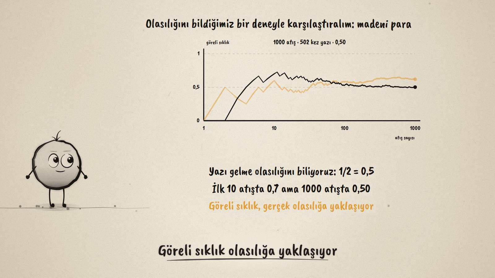
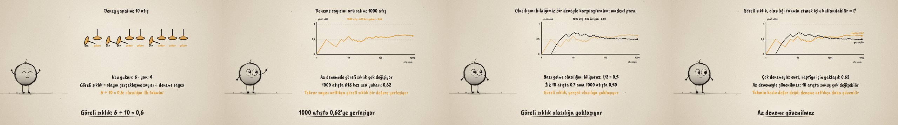

# Deneyle Tahmin · Estimating Probability by Experiment

**▶ Tarayıcıda izleyin / Watch in the browser:** https://hakanatas.github.io/deneyle-tahmin/ 
**⬇ MP4 + altyazılar / MP4 + subtitles:** [Releases](https://github.com/hakanatas/deneyle-tahmin/releases) 
**✎ Kullanılan istem / The prompt behind it:** [PROMPT.md](PROMPT.md) 
**🎞 Bütün filmler / All films:** [Nokta'nın Filmleri](https://hakanatas.github.io/nokta-filmleri/?sinif=6)

> **TR —** 6. sınıf matematik "Veriden Olasılığa" temasındaki MAT.6.6.1 öğrenme çıktısı için hazırlanmış, tamamen JavaScript ile çizilen 92 saniyelik mürekkep animasyonu. Bir raptiye atılınca ya ucu yukarı gelir ya da yan düşer; iki durum eşit şanslı olmadığı için olasılık hesaplanamaz. Deney: 10 atışta 6 kez ucu yukarı; göreli sıklık = olayın gerçekleşme sayısı ÷ deneme sayısı = 0,6, ilk tahmin. Deneme sayısı 1000'e çıkarılınca grafikteki göreli sıklık önce çok iniş çıkış yapıyor, sonra yaklaşık 0,62'ye yerleşiyor (618/1000). Olasılığı bilinen madeni parayla karşılaştırılıyor: ilk 10 atışta 0,7, 1000 atışta 0,50; göreli sıklık gerçek olasılığa yaklaşıyor. Yargı: çok denemeyle göreli sıklık olasılık tahmini olarak kullanılabilir, az denemeyle güvenilmez; tahmin kesin değer değil, deneme arttıkça daha güvenilir. Altyazılar Türkçe, İngilizce ya da ikisi birlikte seçilebilir.

A 92-second ink animation for **6th-grade maths**, the film for the last 6th-grade theme. Nokta, the ink character from [The Learning Ink](https://github.com/hakanatas/the-learning-ink), is the guide again. The experiments are simulated, not drawn by hand: a seeded random generator (`run` in `scenes/scene1.js`) throws the thumbtack (chance 0.62) and the coin (0.5) a thousand times each, and the ten tacks, the counters and both lines on the graph all come from those same throws.

## Learning outcome

MEB, Türkiye Yüzyılı Maarif Modeli, Ortaokul Matematik, 6th grade, "Veriden Olasılığa" theme:

**MAT.6.6.1. Bir olayın olasılığını gözleme dayalı tahmin edebilme**
- a) Bir olayın olasılığı ile deneylerden elde ettiği veriyi ilişkilendirir.
- b) Deneye ait tekrar sayısı ile deneyin çıktılarının göreli sıklıklarının ilişkisine yönelik çıkarım yapar.
- c) Çıkarımlardan hareketle olasılık değerini belirleme için göreli sıklığın kullanımına yönelik yargıda bulunur.

## Scenes

| # | Time | Scene | What happens | Outcome |
|---|---|---|---|---|
| 1 | 0–10 s | Raptiye | Point up or on its side? Two outcomes, not equally likely: no way to compute. | a |
| 2 | 10–28 s | 10 atış | 6 up, 4 on the side; relative frequency 6 ÷ 10 = 0.6. | a |
| 3 | 28–46 s | 1000 atış | The line jumps at first, then settles near 0.62 (618 of 1000). | b |
| 4 | 46–64 s | Madeni para | Known chance 0.5: 0.7 after 10 throws, 0.50 after 1000. | b |
| 5 | 64–80 s | Yargı | With many trials the relative frequency is a good estimate; with few it is not. | c |
| 6 | 80–92 s | Aklında kalsın | Estimate probability by experiment. | a–c |

## Running it

- **Preview:** double-click `index.html` (it works offline).
- **MP4:** run `npm install` once, then `npm run export -- --format=horizontal --captions=tr`.
- **Subtitles and narration:** `npm run srt` writes `out/captions_*.srt` and `narration_notes.txt`.
- **Editing:**
  - Caption text, timings and narration notes: `captions.js`
  - Everything on screen is drawn by `LI.world(t)` in `scenes/scene1.js` (the simulated throws, the thumbtacks, the graph, the words); the other scenes only set the camera.
  - Nokta's poses: `src/draw/film.js`; layout for 16:9 and 9:16: `src/draw/kd.js`

It uses the same engine as The Learning Ink: `renderFrame(t)` as a pure function of time, seeded randomness, and frame-by-frame export.
